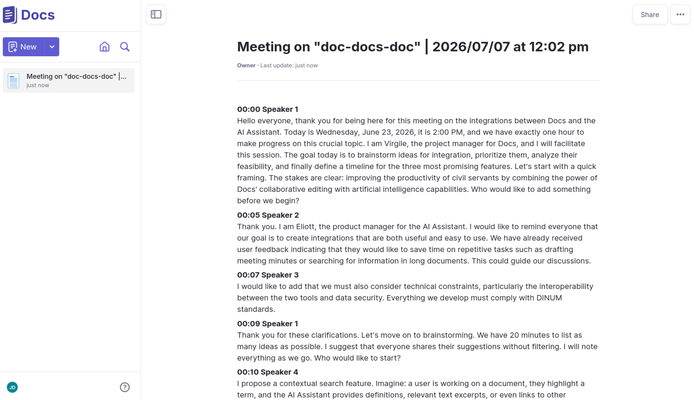
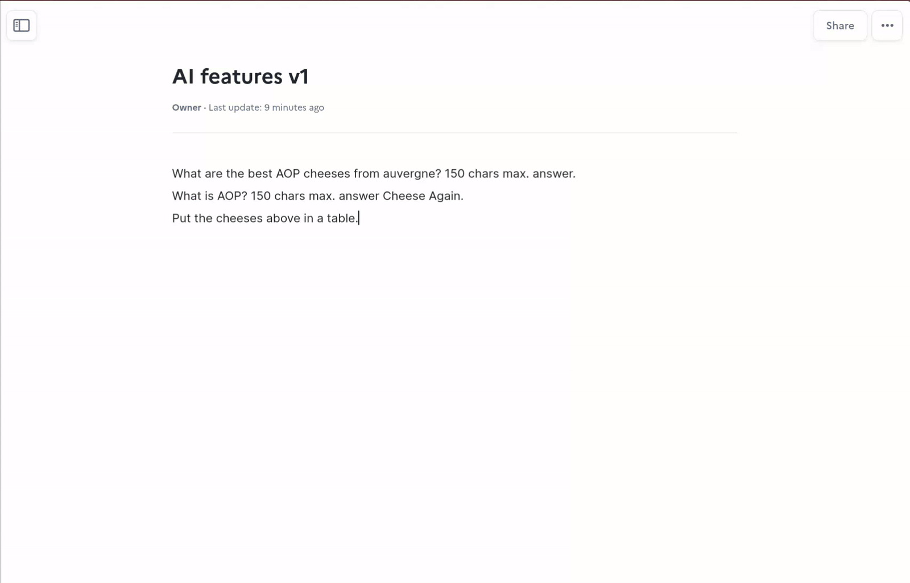
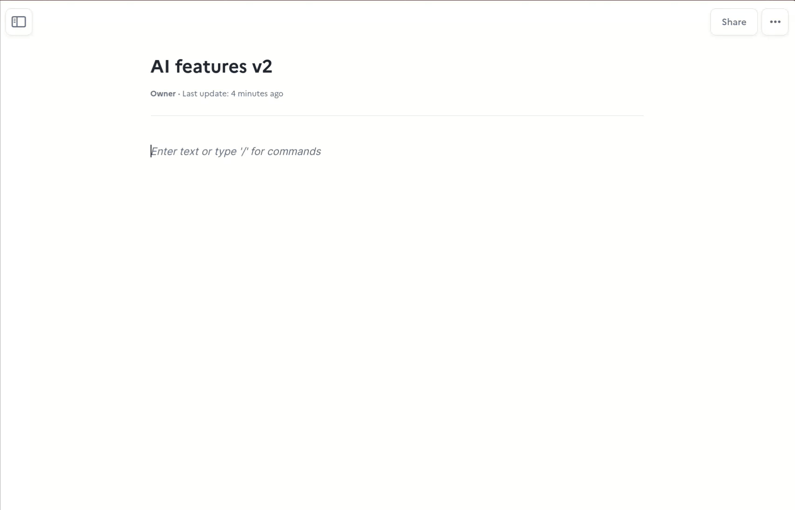

<p align="center">
  <a href="https://github.com/girishlade111/lasuite-docs">
    
  </a>
</p>

<p align="center">
  <a href="https://github.com/girishlade111/lasuite-docs/stargazers/">
    
  </a>
  <a href="https://github.com/girishlade111/lasuite-docs/blob/main/CONTRIBUTING.md">
    
  </a>
  <a href="https://github.com/girishlade111/lasuite-docs/blob/main/LICENSE">
    
  </a>
  <a href="https://digitalpublicgoods.net/r/docs-collaborative-text-editing">
    
  </a>
  <a href="https://github.com/girishlade111/lasuite-docs/actions">
    
  </a>
</p>

<p align="center">
  <a href="https://matrix.to/#/#docs-official:matrix.org">Chat on Matrix</a> •
  <a href="documentation/">Documentation</a> •
  <a href="#try-docs">Try Docs</a> •
  <a href="mailto:docs@numerique.gouv.fr">Contact us</a>
</p>

# La Suite Docs: Collaborative Text Editing

**Docs, where your notes can become knowledge through live collaboration.**

Docs is an open-source collaborative editor that helps teams write, organize, and share knowledge together — in real time. It is an open-source alternative to tools like Notion or Google Docs, focused on real-time collaboration, clean structured documents, knowledge organization, and data ownership through self-hosting.

Built for public organizations, companies, and open communities.

> This repository contains the full source code of the Docs platform: a Django (Python) API backend, a Next.js frontend built on BlockNote/ProseMirror, a Yjs collaboration server, a mail template generator, Helm charts, and Docker/Compose deployment tooling.

---

## Table of contents

- [Features](#features)
- [Demo](#demo)
- [Tech stack](#tech-stack)
- [System architecture](#system-architecture)
- [Repository structure](#repository-structure)
- [Prerequisites](#prerequisites)
- [Quick start (local development)](#quick-start-local-development)
- [Frontend development mode](#frontend-development-mode)
- [Configuration](#configuration)
- [Common Make targets](#common-make-targets)
- [Testing and linting](#testing-and-linting)
- [Internationalization (i18n)](#internationalization-i18n)
- [Email templates](#email-templates)
- [Deployment](#deployment)
- [API and interoperability](#api-and-interoperability)
- [AI features](#ai-features)
- [Contributing](#contributing)
- [Roadmap](#roadmap)
- [License](#license)
- [Credits](#credits)

---

## Features

### Writing

- Rich-text and Markdown editing
- Slash commands and a block-based editor system
- Beautiful, consistent formatting
- Offline editing
- Optional AI writing helpers (rewrite, summarize, translate, fix typos)

### Collaboration

- Live cursors and presence
- Comments and document sharing
- Granular access control per document

### Knowledge management

- Subpages and page hierarchy
- Full-text searchable content

### Presentations

- Slide structure based on the `---` delimiter
- Full-screen mode with keyboard navigation
- Start a presentation from any block
- Dedicated presentation link
- PDF export


### Export / Import

- Import from `.docx` and `.md`
- Export to `.docx`, `.odt` and `.pdf`

### Interoperability

- [Resource server API](documentation/resource_server.md)
- Server-to-server API for pushing content from other services (for example Meet transcripts)



---

## Demo

Experience Docs instantly — no installation required.

- 🔗 [Open a live demo document](https://demo.docs.la-suite.eu/docs/6d1b6f7f-db33-4673-9277-4bf47b9881ec/)
- 🌍 [Browse public instances](documentation/instances.md)

---

## Tech stack

| Layer | Technology |
| --- | --- |
| Backend API | Python 3.x, Django, Django Rest Framework, uv (dependency management) |
| Frontend | Next.js (React), TypeScript, Yarn workspaces (monorepo) |
| Editor | [BlockNote.js](https://www.blocknotejs.org/) on top of [ProseMirror](https://prosemirror.net/) |
| Real-time sync | [Yjs](https://yjs.dev/) CRDT with a HocusPocus collaboration server |
| Database | PostgreSQL |
| Object storage | Any S3-compatible service (MinIO in development) |
| Search | Built-in search backend (see [documentation/search.md](documentation/search.md)) |
| Mail | MJML templates compiled to Django HTML/text templates |
| Infrastructure | Docker, Docker Compose, Kubernetes, Helm, Helmfile, Tilt |
| E2E testing | Playwright (see `src/frontend/apps/e2e`) |

---

## System architecture

Docs runs as a set of containers orchestrated with Docker Compose in development:

1. **Backend (`src/backend`)** — Django application serving the REST API, authentication, documents, permissions, and file storage.
2. **Frontend (`src/frontend`)** — Next.js application (workspace `apps/impress`) rendering the editor UI.
3. **Collaboration server (`src/frontend/servers/y-provider`)** — WebSocket service that relays Yjs updates between clients for real-time co-editing.
4. **PostgreSQL** — primary datastore.
5. **MinIO** — S3-compatible object storage used for attachments and exports during development.

Detailed diagrams and decision records live in [documentation/architecture.md](documentation/architecture.md) and [documentation/adr](documentation/adr).

---

## Repository structure

```text
.
├── bin/                    # Helper scripts (manage, pytest, pylint, kind, terraform, ...)
├── crowdin/                # Crowdin translation configuration
├── deploy/                 # Deployment manifests (PaaS, Helm values, helmfile)
├── docker/                 # Docker entrypoints and auxiliary services
├── documentation/          # Full documentation (install, env, API, ADRs, assets)
├── env.d/                  # Environment variable files per environment
├── gitlint/                # Git commit message linting rules
├── src/
│   ├── backend/            # Django project
│   │   ├── core/           # Domain apps (documents, accounts, permissions, ...)
│   │   ├── demo/           # Demo content fixtures
│   │   ├── impress/        # Django project settings/urls
│   │   └── locale/         # Backend translations
│   ├── frontend/           # Yarn workspaces monorepo
│   │   ├── apps/impress/   # Next.js application
│   │   ├── apps/e2e/       # Playwright end-to-end tests
│   │   ├── packages/       # Shared packages (i18n, eslint plugin, ...)
│   │   └── servers/y-provider/  # Yjs/HocusPocus collaboration server
│   ├── helm/               # Helm chart for Kubernetes deployment
│   └── mail/               # MJML → Django mail templates generator
├── compose.yml             # Development / production compose stack
├── compose-e2e.yml         # Compose stack used for E2E tests
├── Dockerfile              # Multi-stage image build
├── Makefile                # All project commands (see `make help`)
└── Procfile                # Process declarations for container platforms
```

---

## Prerequisites

- **Docker** and **Docker Compose**
- **GNU Make**
- **Git** (and GNU Make on Windows via WSL or Git Bash)

Verify your installation:

```bash
docker -v
docker compose version
make --version
```

> If you hit permission errors, either use `sudo` or add your user to the `docker` group.

---

## Quick start (local development)

> [!WARNING]
> This setup is intended **for development and testing only**. It ships MinIO as the S3-compatible storage backend; any S3-compatible service can be substituted for production.

### 1. Bootstrap the project

```bash
make bootstrap FLUSH_ARGS='--no-input'
```

This builds the `app-dev` and `frontend-dev` containers, installs dependencies, runs database migrations, and compiles translations. Re-run it whenever you pull new code.

### 2. Start the services

```bash
make run
```

Then open **<https://localhost:3000>**.

Default development credentials:

```md
username: impress
password: impress
```

### 3. Django admin

Create a superuser:

```bash
make superuser
```

Admin UI: <http://localhost:8071/admin>

---

## Frontend development mode

For frontend work it is usually faster to run the UI outside Docker:

```bash
make frontend-development-install   # install yarn workspaces
make run-frontend-development       # start Next.js dev server
```

Backend only (everything except the frontend container):

```bash
make run-backend
```

---

## Configuration

All runtime configuration is driven by environment variables defined in `env.d/`:

| File | Purpose |
| --- | --- |
| `env.d/development/common` | Shared variables for local development |
| `env.d/development/common.test` | Overrides used when running tests outside Docker |
| `env.d/development/*.local` | Personal overrides (git-ignored) |

Useful targets to prepare your local environment:

```bash
make create-env-local-files     # generate env.*.local files
make generate-secret-keys       # generate secret keys for common.local
```

The complete reference of every environment variable (database, S3, OIDC, AI gateway, server-to-server tokens, …) is available in **[documentation/env.md](documentation/env.md)**.

Further documentation:

| Topic | Link |
| --- | --- |
| Installation guide | [documentation/installation/README.md](documentation/installation/README.md) |
| Architecture | [documentation/architecture.md](documentation/architecture.md) |
| Collaboration (Yjs) | [documentation/collaboration.md](documentation/collaboration.md) |
| Customization & branding | [documentation/customization.md](documentation/customization.md) |
| Resource server API | [documentation/resource_server.md](documentation/resource_server.md) |
| S3 object storage | [documentation/s3.md](documentation/s3.md) |
| Search indexing | [documentation/search.md](documentation/search.md) |
| Upgrading versions | [UPGRADE.md](UPGRADE.md) |
| Troubleshooting | [documentation/troubleshoot.md](documentation/troubleshoot.md) |

---

## Common Make targets

Run `make help` to list every available target. The most used ones:

| Command | Description |
| --- | --- |
| `make bootstrap` | Prepare the project for local development |
| `make run` | Start the WSGI (production) and development servers |
| `make run-backend` | Start only the backend and its dependencies |
| `make status` | Show running containers |
| `make stop` | Stop the development server |
| `make down` | Stop and remove containers, networks, images and volumes |
| `make logs` | Follow `app-dev` logs |
| `make migrate` | Apply database migrations |
| `make makemigrations` | Create new database migrations |
| `make superuser` | Create an admin superuser |
| `make demo` | Flush the DB and load demo content |
| `make lint` | Lint backend Python sources |
| `make test` | Run project tests |
| `make frontend-install` / `make frontend-development-install` | Install frontend dependencies |
| `make frontend-test` | Run frontend tests |
| `make frontend-lint` | Run the frontend linter |
| `make i18n-generate-and-compile` | Generate and compile all translations |
| `make mails-build` | Convert MJML mail templates to HTML/text |
| `make clean` | Restore the repository to a freshly cloned state |

---

## Testing and linting

```bash
# Backend
make test              # run all backend tests
make test-back         # backend tests only
make test-back-parallel
make lint              # ruff format + ruff check + pylint

# Frontend
make frontend-test     # unit/integration tests
make frontend-lint     # eslint + prettier

# End-to-end
make bootstrap-e2e     # build production images for e2e
make run-e2e           # start the e2e stack
```

Backend tests can also run without Docker — this is useful for configuring PyCharm or VS Code. It requires overriding a few URL/port values that differ inside and outside Docker; see `env.d/development/common` and `env.d/development/common.test`.

Commit messages are linted with [gitlint](.gitlint); install the hooks with `bin/install-hooks.sh`.

---

## Internationalization (i18n)

Docs ships in many languages, with translations managed on [Crowdin](https://crowdin.com/project/lasuite-docs).

```bash
make i18n-generate-and-compile            # extract sources, download translations, compile
make frontend-i18n-extract                # extract frontend messages to JSON
make crowdin-download                     # download translated messages
make crowdin-upload                       # upload source translations
```

Language configuration is documented in [documentation/languages-configuration.md](documentation/languages-configuration.md).

---

## Email templates

Mail templates are written in MJML (`src/mail`) and compiled into Django HTML + plain-text templates:

```bash
make mails-install    # install the mail generator
make mails-build      # mjml → html → plain text
```

---

## Deployment

Docs can be deployed in several ways:

- **Docker Compose** — build the production images and run `compose.yml`.
- **Kubernetes** — Helm chart available in [`src/helm`](src/helm), driven by Helmfile in [`deploy/`](deploy).
- **Community packages** — Nix and YunoHost packages are maintained by the community.

Full instructions: **[documentation/installation/README.md](documentation/installation/README.md)**.

### Production image build note

> [!WARNING]
> Some advanced features (for example *Export as PDF*) rely on XL packages from BlockNote. Those packages are licensed under GPL and are **not MIT-compatible**.
>
> You can run Docs **without these packages** by building with:
>
> ```bash
> PUBLISH_AS_MIT=true
> ```
>
> More details in [documentation/env.md](documentation/env.md).

---

## API and interoperability

Docs exposes two APIs that make integrations straightforward:

- **[Resource server API](documentation/resource_server.md)** — manage documents, users and permissions from external services.
- **Server-to-server API** — push content directly into Docs. With a simple `DJANGO_SERVER_TO_SERVER_API_TOKENS` configuration you can, for example, publish a [Meet](https://github.com/suitenumerique/meet/) meeting transcript into a document and grant access to the requesting user.

See [documentation/env.md](documentation/env.md) for the related environment variables.

---

## AI features

Docs has optional AI features. They are **model agnostic and gateway agnostic**: run your own model or use your provider — the configuration only requires an API key and a URL.

#### V1: You select, AI replaces

A simple select-and-replace workflow: your selection is the context and the instruction for the model, and the AI feedback replaces the selection, optimized for Docs formatting.



#### V2: AI toolbar, AI cursor (beta)

Based on the [BlockNote AI integration](https://www.blocknotejs.org/docs/features/ai):

- an AI toolbar at the selection to prompt, accept, reject and iterate on AI feedback
- an AI cursor that interacts with the document like another collaborator
- document context used on top of the selection



---

## Contributing

This project is community-driven and pull requests are welcome.

- [Contribution guide](CONTRIBUTING.md)
- [Translations on Crowdin](https://crowdin.com/project/lasuite-docs)
- [Chat with us on Matrix](https://matrix.to/#/#docs-official:matrix.org)
- [Security policy](SECURITY.md)
- [Code of conduct](CODE_OF_CONDUCT.md)

Please read the [architecture decision records](documentation/adr) before proposing significant design changes.

---

## Roadmap

Explore upcoming features, priorities and long-term direction on the [public roadmap](https://docs.numerique.gouv.fr/docs/d1d3788e-c619-41ff-abe8-2d079da2f084/).

Release process and versioning: [documentation/release.md](documentation/release.md).

---

## License 📝

This work is released under the **MIT License** — see [LICENSE](LICENSE).

While Docs is a public-driven initiative, our license choice is an invitation for private sector actors to use, sell and contribute to the project.

> This repository is a mirror/fork of [suitenumerique/docs](https://github.com/suitenumerique/docs). All credit for the original work goes to the upstream authors and contributors.

---

## Credits ❤️

### Stack

Docs is built on top of [Django Rest Framework](https://www.django-rest-framework.org/), [Next.js](https://nextjs.org/), [ProseMirror](https://prosemirror.net/), [BlockNote.js](https://www.blocknotejs.org/), [HocusPocus](https://tiptap.dev/docs/hocuspocus/introduction), and [Yjs](https://yjs.dev/). We thank the contributors of all these projects for their awesome work!

We are proud sponsors of [BlockNotejs](https://www.blocknotejs.org/) and [Yjs](https://yjs.dev/).

---

### Gov ❤️ open source

Docs is the result of a joint initiative led by the French 🇫🇷 ([DINUM](https://www.numerique.gouv.fr/dinum/)) Government and German 🇩🇪 government ([ZenDiS](https://zendis.de/)).

We are always looking for new public partners — feel free to [contact us](mailto:docs@numerique.gouv.fr) if you are interested in using or contributing to Docs.

<p align="center">
  
</p>

---

Built by Girish Lade — https://ladestack.in
